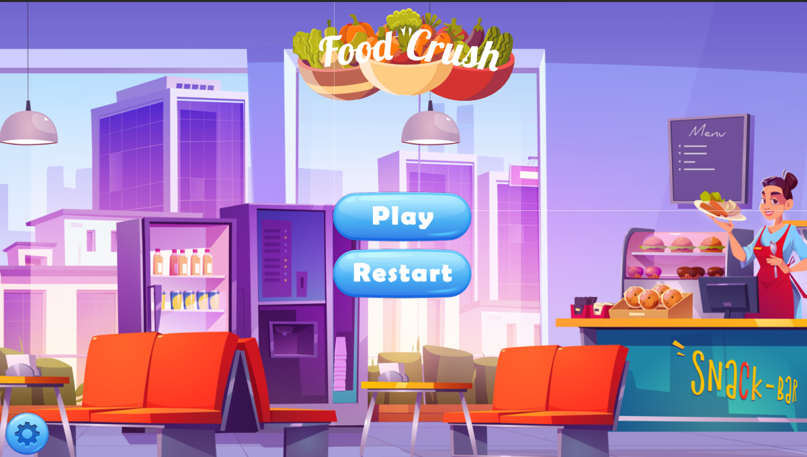
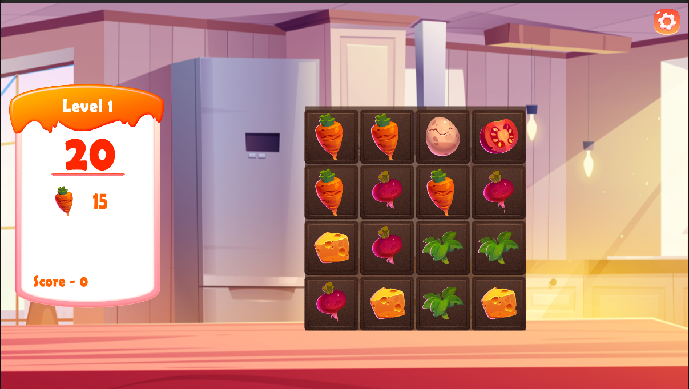

# Food Crush

**Description**  
Food Crush is a fun and challenging 3-in-a-row puzzle game where players match corresponding food items to score points. The gameplay algorithm automatically detects and matches similar items to clear the board.

**Features:**
- Match 3 or more food items in a row to score points.
- Gameplay algorithm that automatically identifies matching items.
- Engaging levels with increasing difficulty.

**Technologies Used:**
- Unity
- C#
- Photoshop for assets

**Platforms:**
- Windows

**Credits:**
- All assets were sourced from free resource sites and used under appropriate licenses.

**Future Plans:**
- [Optional] Mention any updates, like adding new levels, power-ups, or challenges.

---

Feel free to explore more of my work on GitHub!
